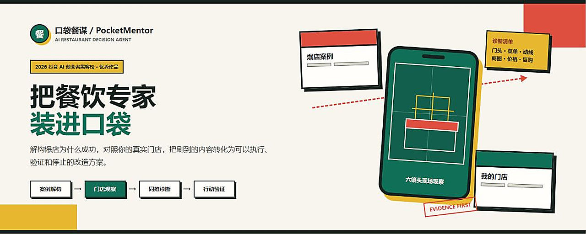
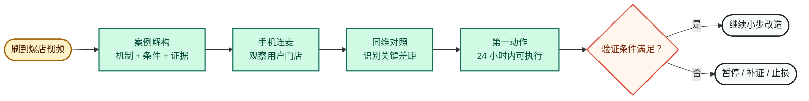
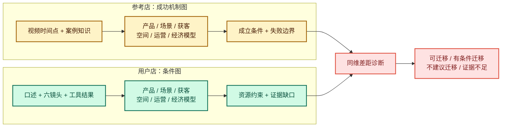
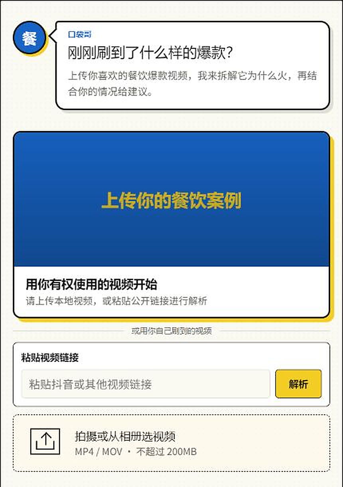
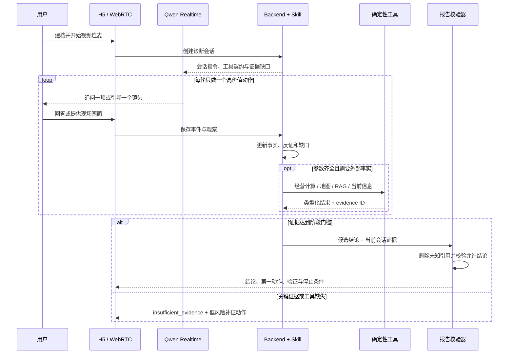
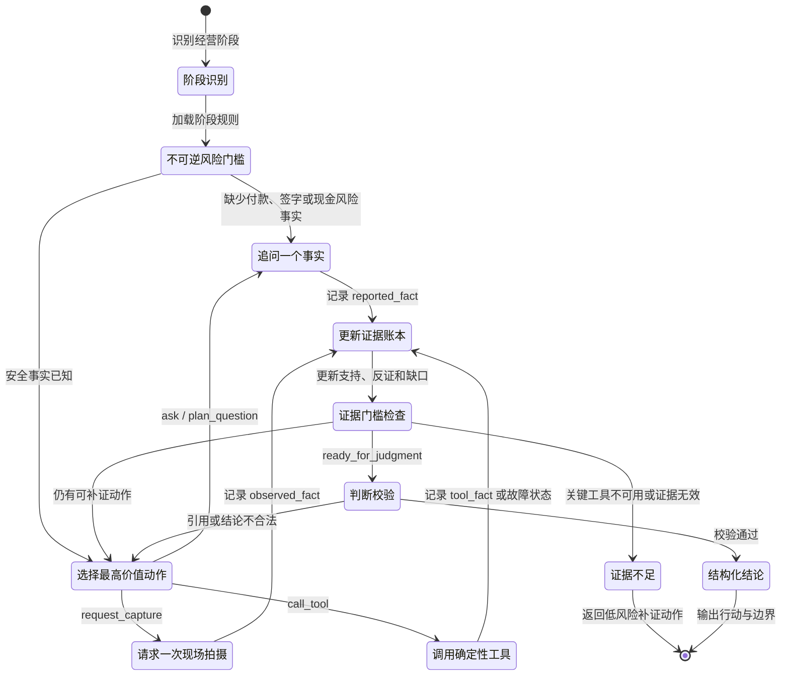

# 口袋餐谋 / PocketMentor

<p align="center">
  
</p>

<p align="center">
  
  
  
  
</p>

<p align="center">
  <strong>把餐饮专家装进口袋</strong><br>
  让刷到的爆店视频不止被看见：解构它为什么成功，对照你自己的门店，再把经验转化为可以执行和验证的改造方案。
</p>

<p align="center">
  <a href="#-从一条爆店视频到一次门店改造">产品链路</a> ·
  <a href="#-knowledge-base--skill--evidence-runtime">核心方法</a> ·
  <a href="#-视频如何进入知识与诊断链路">视频链路</a> ·
  <a href="#-skill-如何驱动一次判断">Skill 工作流</a> ·
  <a href="#-本地运行">本地运行</a>
</p>

> 2026 抖音 AI 创变者黑客松武汉大区赛优秀作品。项目由比赛团队共同创作；本公开快照聚焦我负责的 Agent 决策架构、证据链、实时视频诊断、视频缓存与前后端联调工作。

## 🧭 项目摘要

传统餐饮诊断往往依赖专家到店或线上连麦：专业经验稀缺、服务频率低，而且一次建议很难沉淀为可复用的方法。与此同时，短视频平台上有大量爆店案例，却通常停留在“看起来很火”和“照着做也许能成”的层面。

PocketMentor 尝试完成两次转换：一是把专家式的观察、追问、计算和判断流程放进手机，让普通餐饮创业者更容易获得结构化诊断；二是把短视频从一次性内容转化为带成功机制、适用条件、反证和来源定位的案例材料，再与用户门店的真实条件逐维对照。

这里的“手机里的餐饮专家”是一种产品隐喻。系统不冒充具体专家，不替代专业顾问，也不承诺开店或改造一定成功；它做的是降低获得高质量诊断流程的门槛，并让建议可追溯、可验证、可停止。

## 🔄 从一条爆店视频到一次门店改造

用户不是来获取一份泛化的“网红店装修清单”，而是带着一个具体参照物进入诊断：**这家店为什么火，其中哪些机制适合我，我还缺什么条件，先改哪一件事，看到什么结果才继续？**



这条链路让短视频多了一层产品价值：视频不再只是流量入口，而是可被检索、比较和复用的案例输入；系统也不只生成一份建议，而是给出“为什么这样判断”和“接下来如何验证”。

## 🧩 为什么“照着爆店抄”通常失效

同一套门头、菜单或营销动作，在不同租金、商圈、客群、出品能力和现金跑道下可能产生完全不同的结果。真正需要迁移的不是表面元素，而是它背后的经营机制与成立条件。

| 常见做法 | 缺失的信息 | PocketMentor 的处理 |
| --- | --- | --- |
| 直接照抄网红店 | 不知道成功来自产品、位置、传播、运营还是偶然时点 | 把案例拆成机制、证据、适用条件和限制 |
| 问通用聊天模型 | 模型容易补全不存在的现场事实，建议缺少来源 | 区分四类证据，只允许当前会话真实返回的 evidence ID 进入报告 |
| 填一张静态问卷 | 用户很难准确描述门头遮挡、入口路线、停车和店内动线 | 通过实时视频逐次引导拍摄最能改变判断的画面 |
| 只做一次专家咨询 | 结论依赖当时口述，后续改造缺少验证闭环 | 输出第一动作、验证条件与停止条件，支持下一轮复盘 |
| 只看地图 POI | 有地图记录不等于有人流、进店或真实出单 | POI 只作为工具事实，关键流量仍需现场观察或蹲点记录 |

## 🧠 Knowledge Base + Skill + Evidence Runtime

系统没有把“专家感”交给一段很长的 Prompt，而是拆成三个职责清晰的层次：

| 层次 | 解决的问题 | 主要产物 |
| --- | --- | --- |
| **Knowledge Base** | 过去有哪些可迁移方法、相似案例和用户自己的历史材料 | 方法卡、案例、视频片段、档案事实、稳定 evidence ID |
| **Skill** | 当前应该先问、先拍、先算，还是已经可以判断 | 阶段识别、安全门槛、下一动作、工具编排、允许结论 |
| **Evidence Runtime** | 模型的每句话到底来自哪里，能否支撑当前强度的结论 | 原子事实、证据类型、正反证、缺口、判断校验与运行轨迹 |

### 两家店不是“像不像”，而是“同一维度差多少”



例如，系统不会因为参考店有醒目的红色门头，就直接建议用户把门头改红。它会先判断参考店的门头承担的是远距离识别、品类表达还是打卡传播，再观察用户店在正前、左右、对面和入口路线上的实际可见性，最后才决定是改颜色、改信息层级、处理遮挡，还是根本不该先改门头。

## 🎬 视频如何进入知识与诊断链路

### 1. 案例视频：从文件变成可引用证据

```mermaid
flowchart LR
    accTitle: 视频与知识处理流水线
    accDescr: 本地上传或公开链接经过校验、解析、内容哈希和视频理解后，形成带时间点的私有知识与结构化案例，并可按内容复用已有结果

    input(["本地视频 / 公开链接"]) --> validate["格式、大小与相关性校验"]
    validate --> resolve["链接解析<br/>主路径 + 降级记录"]
    resolve --> hash["计算 SHA-256"]
    hash --> cache{"已有同内容结果？"}
    cache -->|是| reuse["复用分析<br/>同品类复用解构"]
    cache -->|否| understand["视频理解<br/>转写 + 时间点观察"]
    understand --> private_kb["写入用户私有知识"]
    private_kb --> deconstruct["四维案例解构<br/>差异 + 可迁移条件"]
    reuse --> deconstruct
    deconstruct --> diagnosis(["进入实时门店诊断"])

    classDef input_style fill:#f8fafc,stroke:#17211d,stroke-width:2px,color:#17211d
    classDef process fill:#d1fae5,stroke:#0f6f57,stroke-width:2px,color:#064e3b
    classDef decision fill:#fef3c7,stroke:#a16207,stroke-width:2px,color:#451a03
    classDef output fill:#fee2e2,stroke:#df4f3f,stroke-width:2px,color:#7f1d1d

    class input,diagnosis input_style
    class validate,resolve,hash,reuse,understand,private_kb,deconstruct process
    class cache decision
```



实现中的关键边界：

- 上传文件会校验扩展名、内容类型、空文件和可配置的体积上限；链接先做元数据预览和餐饮相关性判断，再进入与本地上传相同的存储、分析和入库路径。
- 链接解析会记录最终使用的 resolver、主路径失败原因和是否发生降级，避免“解析成功”掩盖真实运行状态。
- 视频内容计算 SHA-256。相同内容可复用已有分析结果；案例解构还要求同品类，避免把跨品类差异错误地当成可复用结论。
- 视频理解结果包含转写片段和时间点观察。推断与画面观察分开保存，后续报告引用的是稳定证据标识，而不是模型凭记忆复述。
- 作品集中的约 `5.8 ms` 是开发环境里缓存命中的一次观察，不是跨设备、跨部署环境的通用性能基准。
- 大视频开发链路使用临时上传资源，当前开发配置的资源有效期为 `48 小时`；生产环境应换成有生命周期策略、访问控制和审计能力的对象存储。

### 2. 用户门店：实时看，而不是让用户猜着描述

前端通过浏览器媒体能力建立实时会话。Agent 不要求用户一次拍完固定清单，而是根据当前最大证据缺口，每轮只发出一个拍摄动作。例如：先退后看正面门头，再转向左右和对面，随后补入口路线、停车或外卖动线。作品集记录的约 `2 FPS` 是在现场观察效果与传输成本之间采用的开发策略。

<p align="center">
  
</p>



模型负责自然交互，服务端负责事实边界。经营计算、地图检索、平台/私有 RAG 等关键工具不会依赖模型“自由发挥”调用结果；服务端根据参数完备性确定性执行，并把 `no_hit`、`unavailable` 和 `invalid_result` 分开记录。

## 📚 平台知识与用户私有知识

平台知识库与用户知识库是两条不同的信任域：

| 维度 | 平台知识 | 用户私有知识 |
| --- | --- | --- |
| 内容 | 可迁移方法卡、公开案例的结构化摘要 | 用户上传的视频、转写、门店档案和会话事实 |
| 当前规模 | 93 条：52 张方法卡 + 41 个案例 | 随用户与门店产生，不做公共汇总 |
| 检索范围 | 按阶段、主题和证据等级过滤 | 必须同时匹配已认证 `user_id` 与 `store_id` |
| 证据标识 | `rag:platform:<knowledge_id>:<version>` | 与具体用户、门店、视频和片段绑定 |
| 公开边界 | 仅分发短摘要和公开来源链接 | 不进入其他用户的检索上下文 |

### 证据等级不是装饰标签

当前 manifest 中的 93 条记录由 `52 reviewed`、`25 golden` 和 `16 secondary` 组成：

- `golden`：原始视频或转写经过独立核对，保留来源定位、事实字段、推理链和可获得的结果信息。
- `reviewed`：方法卡或案例已做内部复核，可以进入最终判断。
- `secondary`：只用于发现线索或弱类比，不能作为决定性证据。

这些数字描述的是知识治理状态，不代表诊断准确率。现有案例中的部分经营数字来自参与者口述且带时间定位，但没有经过后续经营结果验证；README 和运行时都保留这一限制。

公开版本默认提供安全的词法检索 fallback，并通过 Port 保留替换能力。向量检索、元数据过滤和 reranking 是生产部署建议，不应被误写成当前公开快照的默认路径。

## 🧰 Skill 如何驱动一次判断

餐饮问题首先被识别为四个阶段之一：`planned_opening`、`site_selection`、`franchise` 或 `operating_loss`。不同阶段拥有不同的必要事实、关键工具和允许结论，避免用一套模板回答所有经营问题。



### Evidence Runtime 的四类事实

| 类型 | 含义 | 能否直接当作已核验事实 |
| --- | --- | --- |
| `reported_fact` | 用户口述，如租金、营业额或已付定金 | 否，报告必须标注“用户口述，尚未核验” |
| `observed_fact` | 从视频、照片、合同或账目直接观察到的内容 | 可以，但必须保留时间点或来源定位 |
| `tool_fact` | 经营计算、地图、当前信息或 RAG 返回的类型化结果 | 可以，但不能超出工具本身证明的范围 |
| `inference` | 模型综合证据形成的解释 | 不能单独支撑继续投资、签约、关店或止损 |

最终报告只接受本次会话上下文实际返回过的 evidence ID。系统会删除模型生成的未知引用，并检查正反证是否重叠、纯推断是否支撑了强结论、结论是否属于当前阶段的 `allowed_conclusions`。任何一项不满足，就回到补证或输出 `insufficient_evidence`。

一次合格的最终输出被压缩为六部分：一个主结论、最多三条决定性证据、一项最可能推翻结论的反证或缺口、一个 24 小时内可执行的第一动作、一个验证条件和一个停止条件。

## 🧪 我解决的具体工程问题

| 具体问题 | 关键判断 | 实现 | 结果与边界 |
| --- | --- | --- | --- |
| 爆店表象难以迁移 | 应迁移“机制 + 条件”，不是复制装修和话术 | `Knowledge Base + Skill + Evidence Runtime` 串联案例解构、同维对照与行动验证 | 可以解释为什么建议某项改造；仍需要用户现场与经营数据验证 |
| 模型把推断写成事实 | 生成质量不能替代证据约束 | 四类证据模型、稳定 evidence ID、未知引用剔除、判断校验器 | 降低凭空下结论的风险；来源本身不可靠时仍会污染判断，因此保留证据等级 |
| 表单无法描述门店现场 | 应按当前缺口动态拍摄，不应让用户填专业材料 | WebRTC + Qwen Realtime；正前、左右、对面、入口路线、停车/外卖动线的六镜头协议 | 降低描述门槛；浏览器权限、网络和画面质量会影响可用性 |
| 实时模型工具调用不稳定 | 经营计算和权限边界必须留在服务端 | 参数满足后确定性注入工具，使用类型化输入输出并记录运行轨迹 | 失败状态可解释、可恢复；第三方服务不可用时必须降低结论强度 |
| 重复分析视频成本高 | 内容相同就不应重复理解，解构复用还要考虑品类 | SHA-256 分析缓存；同内容、同品类复用案例解构 | 开发缓存命中观察约 5.8 ms；不是生产性能承诺，缓存也不能跨品类滥用 |
| 大视频无法直接进入模型 | 上传介质与业务证据应解耦 | 小视频直传；大视频走临时资源，再把分析结果结构化入库 | 开发临时资源 48 小时有效；生产需持久对象存储与生命周期治理 |
| 通用检索可能越权或混淆来源 | 平台经验和用户数据必须是不同信任域 | 平台/私有 RAG 分离；私有检索校验 `user_id` 与 `store_id`；报告限制为当前会话证据 | 防止跨用户降级检索；公开 fallback 仍是词法检索，生产向量检索需另行接入 |

## 🌱 科技平权与短视频的二次价值

这里的科技平权并非用 AI 取代真人专业服务，而是把原本只有到店咨询或高质量连麦才能获得的流程拆成更多人可以触达的基础能力：

1. **服务可及性**：用户可以直接从手机发起案例分析和现场连麦，不必先组织完整的经营报告。
2. **情境可见性**：Agent 能看到门头、入口和动线，不再只依赖用户是否会描述问题。
3. **经验可复用性**：爆店视频被解构为方法、条件和限制，而不是一次看完即逝的内容。
4. **判断可验证性**：建议必须绑定证据、第一动作、验证条件和停止条件，让创业者知道何时继续，也知道何时该停。

这使短视频形成一条新的使用链：**内容消费 → 案例结构化 → 个体门店诊断 → 低成本试验 → 结果复盘**。平台内容不只是获得观看和互动，还可以成为普通经营者理解行业规律、识别自身差距和降低试错成本的公共入口。

## ✅ 工程评估

公开快照的自动化测试分为三层，共 142 项。它们验证的是软件合同、权限、状态流和跨层集成，不代表餐饮诊断准确率或经营成功率。

| 测试层 | 数量 | 主要覆盖 |
| --- | ---: | --- |
| Decision Core | 51 | 安全门槛、阶段事实、下一动作、工具失败、检索等级、证据校验和运行时轨迹 |
| Backend | 77 | API、用户/门店作用域、视频上传与缓存、知识入库、诊断报告、实时配置和工具注册 |
| Integration | 14 | 决策内核与后端合同、离线复现、案例流程与错误路径 |
| **合计** | **142** | 脱敏公开快照的工程回归保障 |

更进一步的产品评估需要真实用户研究：建议采纳率、关键事实补全率、专家一致性、改造前后经营指标和误导性建议率都不应被现有工程测试替代。

## ⚠️ 适用边界与责任使用

- 系统不保证开店、改造、加盟或止损决策成功；高金额、法律、食品安全和人身安全问题应由具备相应资质的专业人士处理。
- 地图 POI 只证明地图中的记录，不证明真实客流、目标客群、进店或出单。
- 历史案例不能证明当前品牌状态、商圈变化、法律风险或未来经营结果；加盟问题需要当前信息核验。
- 视频中的排队、满座或热闹只代表拍摄时点，也可能受高峰、活动或内容编排影响。
- 证据不足、关键工具不可用或结果无效时，只允许输出低风险补证动作与 `insufficient_evidence`。
- 实时视频依赖浏览器摄像头/麦克风权限和网络质量；约 2 FPS 是开发策略，不是所有设备的固定表现。
- 公开仓库只包含结构化摘要和来源链接，不分发第三方原始视频、音频、转写、肖像或声音。使用者仍需自行核实内容授权。

## 🚀 本地运行

### 环境要求

- Python `>= 3.12`
- 支持摄像头与麦克风的现代浏览器（仅在使用实时视频时需要）
- 按所选 Provider 准备自己的服务凭据；仓库不提供任何真实 API key

### 启动后端

Windows PowerShell：

```powershell
cd "4.产品-视频对照诊断MVP/backend"
py -3.12 -m venv .venv
.venv\Scripts\Activate.ps1
python -m pip install -e ".[dev]"
Copy-Item .env.example .env
python -m uvicorn yongge_online.main:app --host 127.0.0.1 --port 8010
```

macOS / Linux：

```bash
cd 4.产品-视频对照诊断MVP/backend
python3.12 -m venv .venv
source .venv/bin/activate
python -m pip install -e ".[dev]"
cp .env.example .env
python -m uvicorn yongge_online.main:app --host 127.0.0.1 --port 8010
```

### 启动前端

```bash
python -m http.server 5173 --bind 127.0.0.1 --directory web
```

打开 `http://127.0.0.1:5173/`。静态前端可以直接浏览；视频分析、实时会话、工具和报告需要后端及相应 Provider 配置。

### 运行测试

在仓库根目录执行：

```bash
python -m pytest "4.产品-视频对照诊断MVP/engine/decision_core/tests" -q
python -m pytest "4.产品-视频对照诊断MVP/backend/tests" --ignore="4.产品-视频对照诊断MVP/backend/tests/live" -q
python -m pytest "4.产品-视频对照诊断MVP/integration/tests" -q
```

`backend/tests/live` 会调用付费外部服务，需要本地凭据，因此默认排除。

## 🗂️ 仓库结构

| 路径 | 内容 |
| --- | --- |
| `4.产品-视频对照诊断MVP/engine/decision_core/` | 餐饮决策 Skill、Evidence Runtime、平台知识、评估与单元测试 |
| `4.产品-视频对照诊断MVP/backend/` | FastAPI、视频解析、知识服务、实时会话、确定性工具与报告 |
| `4.产品-视频对照诊断MVP/integration/` | 跨层合同、离线复现和集成测试 |
| `web/` | 移动端 H5 原型 |
| `docs/product/` | 产品、知识库和案例设计文档 |
| `docs/assets/readme/` | README 品牌主视觉与真实产品截图 |

## 🔐 配置与安全

- 根目录与后端目录的 `.env.example` 只保留变量名和非敏感默认值；复制后的 `.env` 不应提交到 Git。
- 凭据通过环境变量读取，例如 `DEEPSEEK_API_KEY`、`YONGGE_DASHSCOPE_API_KEY` 和 `YONGGE_AMAP_WEB_SERVICE_KEY`。
- 生产环境应使用部署平台的 secret manager，并禁止提交 Cookie、私钥、SQLite 文件、上传文件和运行日志。
- 如果凭据曾进入 Git 历史，仅删除当前文件不够：应立即撤销和轮换凭据，再清理历史、构建缓存和部署环境。
- 详细披露流程见 [SECURITY.md](SECURITY.md)。

## 📄 公开快照与内容授权

这是比赛共创项目经过脱敏后的公开代码快照。代码、文档、知识条目和媒体素材可能具有不同的著作权或授权条件；发布或再利用前，请确认所有贡献者同意，并分别核实第三方内容的许可。本仓库不对未明确授权的第三方视频、音频、肖像、声音或文本授予额外权利。
